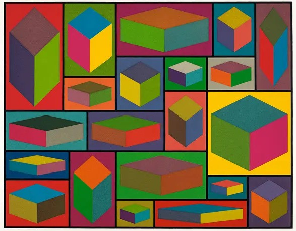
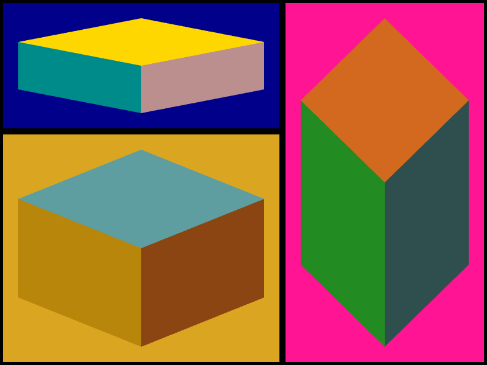
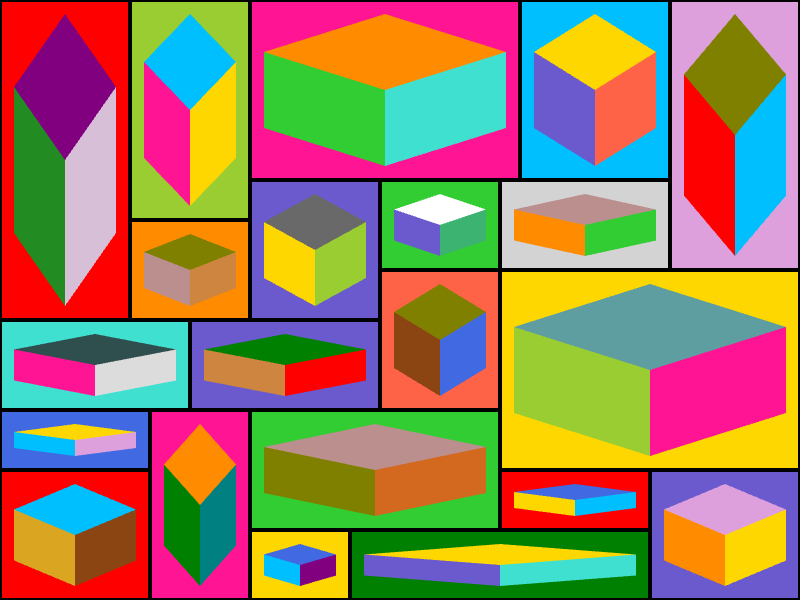

# Reprodução de pintura em p5.js - *Distorted Cubes (D)*

  <strong>Distorted Cubes (D). Sol LeWitt, 2001</strong>

  

Link da imagem: https://stevenvailfinearts.com/art/distorted-cubes-by-sol-lewitt

## Processo

### Etapa 1 - Versão simplificada

Nessa primeira versão, desenhei na mão cada quadrilátero da imagem para reproduzir só uma parte da composição e entender a lógica dos blocos e das formas isométricas. O resultado está em [mini.js](mini.js) e a imagem de registro dessa etapa é [mini.png](mini.png).

  

### Etapa 2 - Versão completa

Depois, percebi o padrão da imagem: todo cubo ficava centralizado no quadrante. Como a composição se repetia muito, resolvi criar uma função para desenhar o quadrante e ela já monta os cubos automaticamente. Assim, levei a mesma lógica para o quadro completo, organizando todos os quadrantes da composição. O registro visual dessa etapa está em [complete.png](complete.png) e a implementação correspondente está em [complete.js](complete.js).

  

### Etapa 3 - Versão animada

Na última etapa, transformei a pintura em uma versão interativa. O sketch principal está em [index.html](index.html) e [MariaClara.js](MariaClara.js). Ao clicar em qualquer quadrante, as cores daquele cubo trocam como se ele estivesse sendo rotacionado, mantendo a estrutura geométrica original intacta.

## Arquivos

- [index.html](index.html) — página principal que carrega a biblioteca p5.js e o sketch animado.
- [MariaClara.js](MariaClara.js) — código da versão interativa.
- [mini.js](mini.js) — versão simplificada do processo.
- [complete.js](complete.js) — versão completa do processo.
